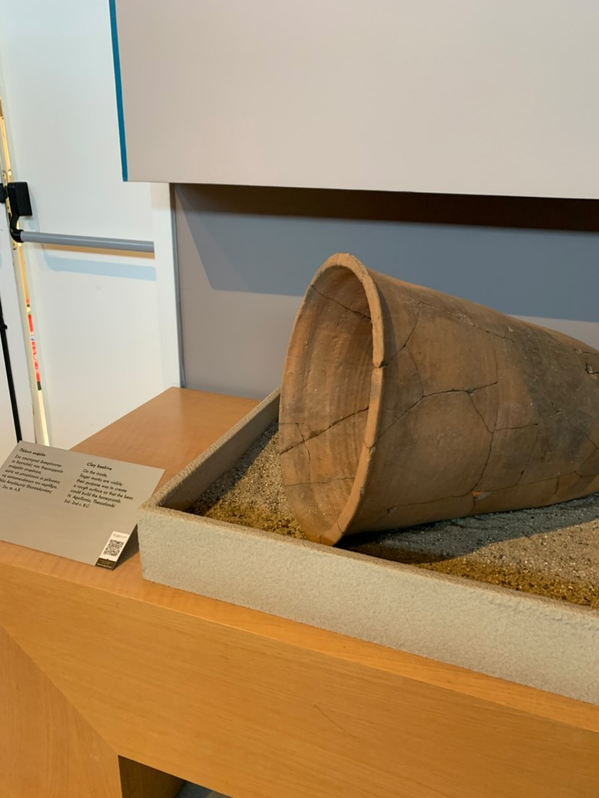
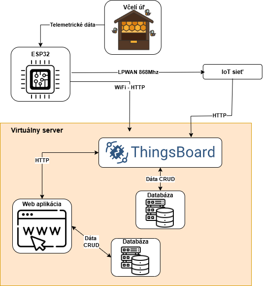
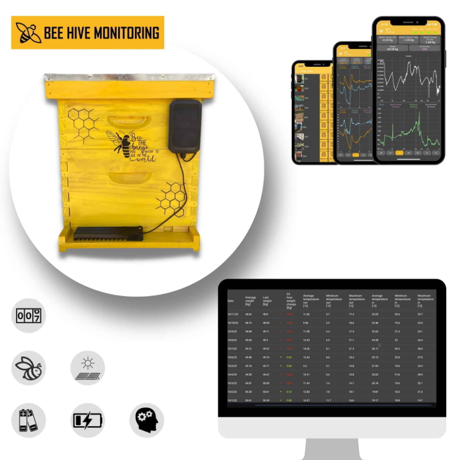
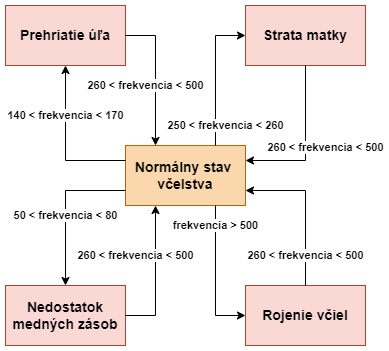

---
# 🧩 Versioning
fm_version: "1.0.1"
fm_build: "2025-10-13T10:15:00Z"
fm_version_comment: "Initial version for student KNIFE template – Project Summary"

# 🆔 Identity
id: "K000002"
guid: "00000000-0000-4000-8000-000000000002"

# 🧭 Context
dao: "knife"
title: "KNIFE – Project Summary (Student Template)"
description: "Študentský template pre súhrn projektu – tím, ciele, prínos a plán."

# 👥 Authorship
author: "Študent"
authors: ["", "", ""]

# 🗂 Classification
category: "knife"
type: "project-summary"
priority: "top"
tags: ["project", "summary", "student"]

# 🌍 Localization & Routing
slug: "project-summary"
locale: "sk"
sidebar_label: "Project Summary"

# 🕒 Lifecycle
created: "2025-10-13"
modified: ""
status: "inprogress"

# ⚖️ Intellectual Property
rights_holder_content: "Študent"
rights_holder_system: "SystemThinking / KNIFE Template"
license: "CC-BY-NC-SA-4.0"
disclaimer: "Použitie na vzdelávacie účely. Obsah je osobný a dobrovoľný."
copyright: "© 2025 Autor príspevku"

# 🔗 Provenance (Origin)
origin_repo: "class_template_v5"
origin_repo_url: ""
origin_commit: ""
origin_system: "docusaurus"

# 🪪 Optional Identifiers
author_id: ""
author_did: ""

# 🧱 Reserved / Future use
fm_reserved1: ""
fm_reserved2: ""
---

# Zamyslenie pre publikum

# 📘 Project Summary

Systém umožňuje monitorovať stav včelích úľov pomocou IoT senzorov, ktoré priebežne zbierajú údaje o teplote, vlhkosti, aktivite a ďalších parametroch včelstva. Získané dáta sú spracovávané v reálnom čase a prezentované v interaktívnom používateľskom rozhraní s prehľadnými vizualizáciami.
Súčasťou riešenia je aj inteligentný modul upozornení, ktorý na základe meraní automaticky deteguje neštandardné situácie a okamžite informuje používateľa o možnom riziku alebo zmene stavu včelstva.

## Architektúra systému

---

## 👥 Tím
- **Názov tímu:**  
- **Členovia:**  
  - Adam Grík – Vývoj softvéru  
  - Maximilián Strečanský – Vývoj hardvéru  

---

## 🎯 Ciele projektu
- Hlavný cieľ:
  -  Implementácia systému na monitorovanie včelích úľov pomocou IoT
  -  Integrovať IoT platformu ThingsBoard na zber, analýzu a vizualizáciu nameraných údajov zo včelích úľov.
 
  
---

## 💡 Zámer a pridaná hodnota
Tento projekt sme si vybrali, pretože sa zameriava na modernizáciu včelárstva a taktiež sme sa chceli naučiť pracovať s IoT
- Primárne pre včelárov, ktorí získajú nástroj na pohodlnejšie sledovanie stavu úľov
- Nedostatočný prehľad o stave úľov bez fyzickej kontroly  
- Prácu s IoT.

### Identifikácia stavu včelstva na základe frekvencie 

---

## 🧭 Predpokladaný postup
Requirements:
- Identifikácia potrebných senzorov a integrácie s ThingsBoard.
 
Design:
- Návrh architektúry systému, dátového modelu a dashboardov.

Implementation:
- Implementácia IoT zariadení, nastavenie ThingsBoard, tvorba webovej aplikácie.

Test:
- Testovanie prenosu dát a funkčnosti dashboardov
  
Deploy:
- Nasadenie systému a sprístupnenie webovej stránky
  
Očakávané výstupy:
- Funkčný prototyp monitorovacieho IoT zariadenia
- IoT platforma
- Prezentačna webová aplikácia

---

## ⏳ Časový rámec
| Fáza | Trvanie | Popis |
|------|----------|--------|
| Príprava | 1 týždeň | Zoznámenie s témou a plánovanie |
| Realizácia | 6 týždňov | Vývoj a testovanie |
| Záver | 2 týždne | Prezentácia a hodnotenie |

---

**Navigation:** [🏠 Home](../../index.md) · [↩️ KNIFES Overview](../index.md)
